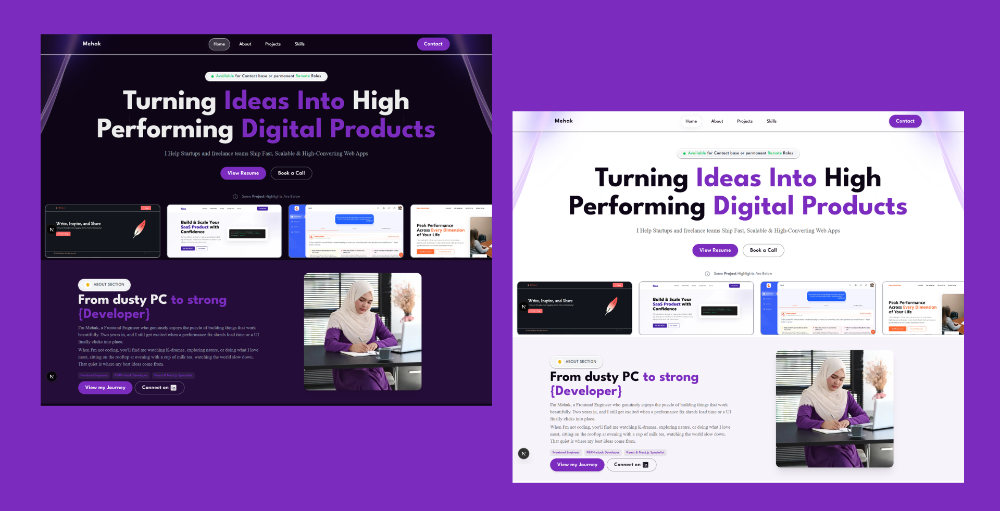
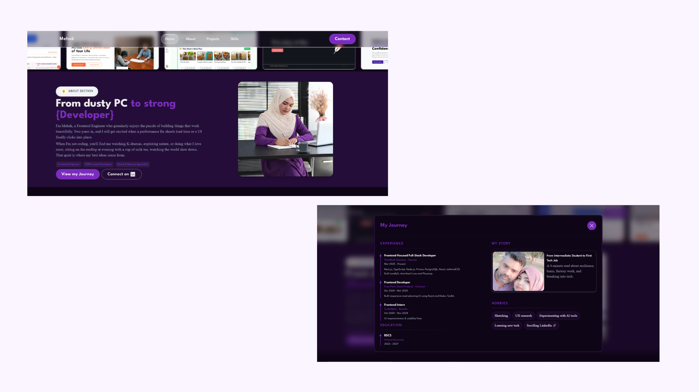

# Portfolio Reusable Open-Source Template

## Table of Contents

- [View Demo](#-view-demo)
- [Features](#features)
- [Setup Guide](#-setup-guide)
- [Planning for Future Customization](#planning-for-future-customization)

---

## View Demo

Live Demo:  
https://mehak-naqvi.vercel.app/

---

## Features

- **Theme Adaptive**  
  Fully adapts to the device theme. Portfolio will appear dark or light based on device theme.
  

- **Hero Section**
  - Displays availability and credibility based on context (job seeker availability, freelancer credibility).
  - Bold heading with horizontal infinite animation.
  - Quick showcase of your work.

- **Navigation Bar**
  - Customizable nav links: choose between Skills section or Service section.
  - Helps both job seekers and freelancers.
  - Your name appears on the navbar.

  ```
  *about.ts*
  export const portfolioForJob = true; // can be for freelancing the service section and others will work
  ```

- **About Section**
  - Image with a catchy heading.
  - Short about text + highlight roles or expertise.
  - "View My Story" button to share your education, experience, or hobbies.
    

- **Project Section**
  - Projects categorized by type.
  - Filter projects based on categories.
  - Default view shows 2 projects with a "See More" button to prevent long scrolling.

- **Skills Section**
  - Interactive universe-style animation displaying skill logos.
  - Top filters provide quick access to particular skills.

- **Service Section**
  - Visibility of Skills and Service sections can be customized.
  - Displays images in services to maintain a human touch in the AI era.

- **Contact Section**
  - Email, location, social icons, and a contact form.

- **Footer**
  - Copyright information.
  - Social links.
  - Navigation links.

---

## Setup Guide

For installation and setup instructions, please refer to:
[REUSABLE_SETUP.md](./REUSABLE_SETUP.md)

---

## Planning for Future Customization

- **Theme Control**
  Users may want to enable or disable dark/light theme adaptation. This permission will be added in future updates.

## Support

If this project helps you or you use it in your portfolio, I’d genuinely appreciate your support:

- Star this repository to support the project and help it reach more developers
- Follow me on GitHub for more open-source projects like this
- Report issues if you find bugs or want improvements
- Reach out for questions or feedback

Email: mehak313naqvi@gmail.com
LinkedIn: https://www.linkedin.com/in/miss-kniz
